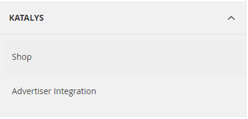
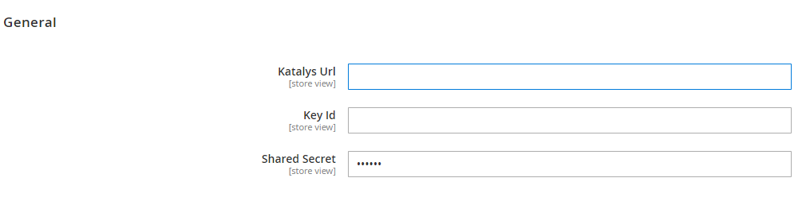
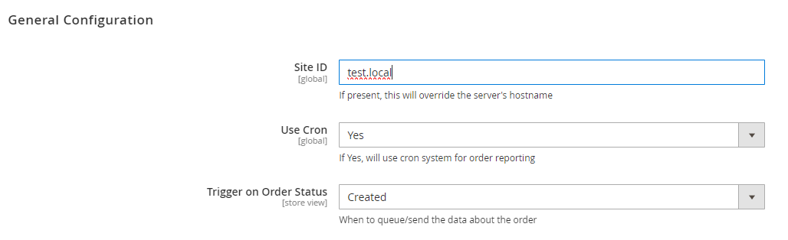
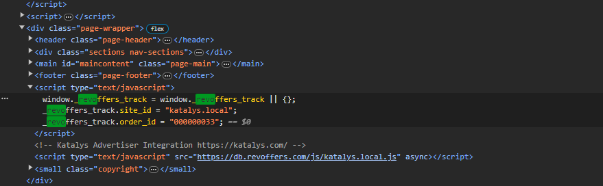

# Katalys
Magento module for Katalys shop integration and This plugin provides a no-hassle integration for advertisers integrating with the Katalys Performance Affiliate Network.

Katalys is a performance-based advertising network for transformational health products and brands. Our publishers deliver high converting in-market traffic to an exclusive list of curated products on the market. Want more eCommerce customers for your brand? Partner with Katalys to craft an enticing performance offer; we’ll do the rest.

# Installation

Run the following command to install the package using composer:
```
composer require katalys/magento-bridge-module
bin/magento module:enable Katalys_Shop
bin/magento setup:upgrade
php bin/magento setup:static-content:deploy
php bin/magento setup:di:compile
```
# How to update

To update this module run the following command:
```
composer update katalys/magento-bridge-module
```
Note that this will also update any other packages in the project according to composer definition. Depending on the nature of the update the following commands might also be required:
```
bin/magento setup:upgrade
bin/magento setup:di:compile
bin/magento setup:static-content:deploy
```
# Rollback Version

If happen error with the new version, You can revert the version. If you install version 1.0.1 and need to rollback the update to the last version that worked 1.0.0, You have an example below:
```
composer require katalys/magento-bridge-module:1.0.0
bin/magento setup:upgrade
php bin/magento setup:static-content:deploy
php bin/magento setup:di:compile
```
If happen error with your version, after rollback, You can send an email to us about the problem. In the email, please, give us the information below:

* Magento version
* Module Version
* PHP version
* Description the error
* step-by-step instructions to get error
* Screenshot and video if possible

Send us the email with the details above to *support@katalys.com*.

# Removal

Run the following command to remove the package using composer:
```
bin/magento module:disable Katalys_Shop
composer remove katalys/magento-bridge-module
composer update
php bin/magento setup:static-content:deploy
php bin/magento setup:di:compile
```

# Configuration

Open the Admin interface and go to Stores -> Configuration -> Katalys. To customize the plugin's operation, You will find two menus:



The menu Shop, You will find the configuration below:



The menu Advertiser Integration, You will find the configuration below:



* **Site ID**: This is how your website is identified on the Katalys network. The plugin's default will use your website's domain (with any prefix like "www." removed). *Do not change this setting unless directed by a Katalys representative!*

* **Use Cron**: This flag controls whether the plugin uses a stateful background table to track tasks. Using the cron system is suggested as it can improve your website's performance.

## Verifying Installation
The plugin adds a snippet of JavaScript to your web pages. This snippet enables Katalys to attribute orders to its affiliates.

To verify the plugin has been installed and the appropriate Magento caches have been cleared, look at the source code of any public page -- we suggest simply starting with the homepage. The process to view a page's source is slightly different depending on which browser you're using, but most offer an option of "View Page Source" when right-clicking on the page.

Within the source of the page, you should see a JavaScript snippet as indicated in this screenshot.


